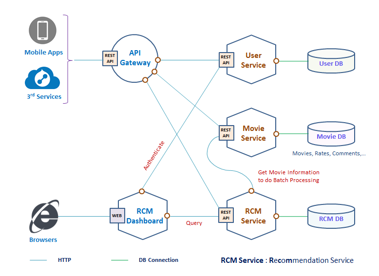
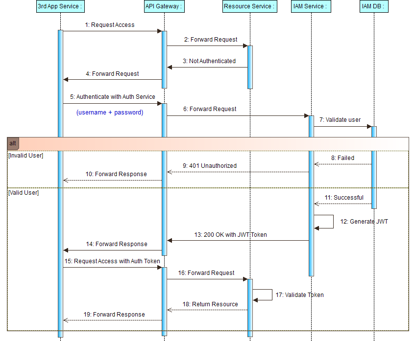
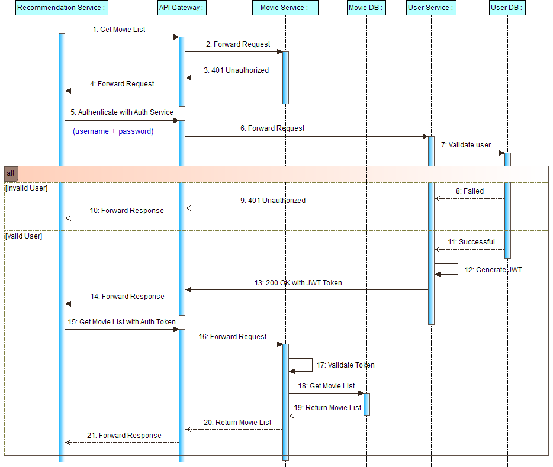
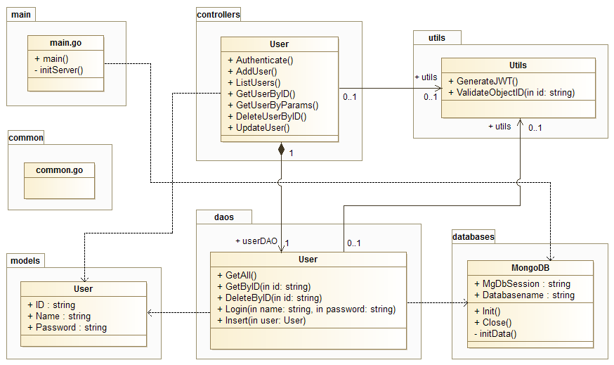

# Golang Microservices

A **Microservices Architecture** consists of a collection of small, autonomous **services**. Each **service** is self-contained and should implement a single business capability. 

Below is an example of designing and implementing **Microservices** using:
* [**Gin Gonic**](https://github.com/gin-gonic/gin)
* [**Traefik**](https://github.com/containous/traefik)
* [**MongoDB**](https://www.mongodb.com/download-center)

### 1. Movie Microservices Example Architecture


#### 1.1. Microservices Authentication Flow In General
| Terms | Description |
|-|-|
| **3rd App Service**| Outternal services that want to use/integrate with Movie service. |
| **API Gateway** | The single entry point for all clients. The API gateway proxied/routed requests to the appropriate service. |
| **IAM Service** | Service that authenticates user and grants authorizations (permissions).|
| **Resource Service** | Service that hosts protected resources and validates access token during resource access. |



#### 1.2. Recommendation Service Authentication Flow



#### 1.3. Class Diagram Of User Management Service



***
### 2. Movie Service Build & Run
#### 2.1. Setup development environement
* Install Golang
* Install MongoDB

    <https://docs.mongodb.com/manual/installation>

* Start MongoDB
```sh
$ mongod --dbpath="[your_database_path]"
```
* Install neccessary Golang packages 
```sh
$ go get -u github.com/swaggo/swag/cmd/swag github.com/swaggo/gin-swagger github.com/swaggo/gin-swagger/swaggerFiles github.com/alecthomas/template github.com/gin-gonic/gin github.com/sirupsen/logrus gopkg.in/mgo.v2/bson github.com/natefinch/lumberjack
```


<em><strong>NOTE:</strong> You can change host and basePath of the service by editting the file <strong>./docs/docs.go</strong></em>

##### - Change configuration file
<em>Update values of file **./config/config.json**</em>
```sh
{
    "port": ":8808",
    "enableGinConsoleLog": true,
    "enableGinFileLog": false,

    "logFilename": "logs/server.log",
    "logMaxSize": 10,
    "logMaxBackups": 10,
    "logMaxAge": 30,

    "mgAddrs": "127.0.0.1:27017",
    "mgDbName": "go-microservices",
    "mgDbUsername": "",
    "mgDbPassword": "",

    "jwtSecretPassword": "raycad",
    "issuer": "seedotech"
}
```

##### -  Run services
* Run the <strong>Authentication</strong> service
```sh
$ cd [go-microservices]/src/user-microservice
$ go run main.go
>> [GIN-debug] Listening and serving HTTP on :8808
```
